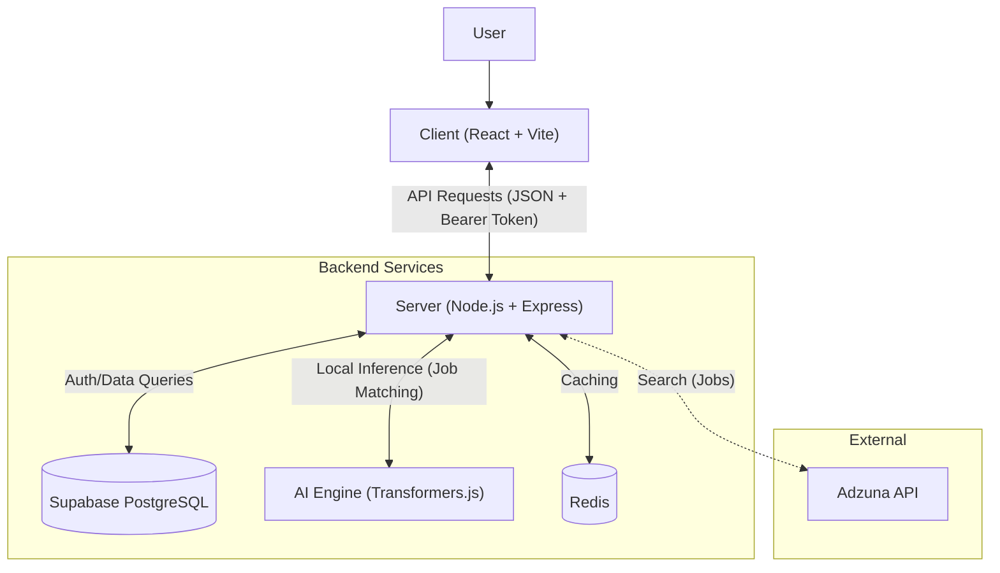

# System Design Layout

This document details the system architecture for the "Insight" application.

## 1. High-Level Architecture
The application follows a standard Client-Server architecture with a segregated frontend and backend.

## 2. Technology Stack

### Frontend (Client)
- **Framework**: React (v18) with Vite for build tooling.
- **Language**: TypeScript.
- **Styling**: TailwindCSS and HeroUI for utility-first, premium styling.
- **Animations**: Framer Motion for smooth transitions.
- **State/Routing**: React Router DOM (v6).
- **HTTP Client**: Axios.

### Backend (Server)
- **Runtime**: Node.js.
- **Framework**: Express.js.
- **Language**: TypeScript.
- **Database Connector**: `pg` (node-postgres).
- **Caching**: Redis for high-performance job data storage.
- **AI/ML**: `@xenova/transformers` (running locally/in-process) for job matching.

### Database
- **Provider**: Supabase.
- **Type**: PostgreSQL relational database.
- **Key Tables**:
    - `users`: Stores user credentials and profile data.
    - `profile`: Stores user skills and experience for matching.

## 3. Core Components & Responsibilities

### Authentication System
- **Custom Implementation**: Uses `bcrypt` for secure password hashing and `jsonwebtoken` for stateless session management.
- **Components**:
    - `bcrypt`: Hashes passwords before storing in Supabase.
    - `jwtGenerator`: (Internal) Issues signed tokens upon successful login/registration.
- **Endpoints**: `/auth/register`, `/auth/login`, `/auth/verify`.
- **Middleware**: `authorise` protects private routes by verifying JWT tokens.

### Job Matching & Discovery
- **Adzuna Integration**: Fetches live job listings and caches them in Redis to minimize API latency.
- **AI-Powered Matching**: 
    1. Server fetches job descriptions.
    2. Server runs `getJobRecommendations` using the `Xenova/distilbert-base-uncased-mnli` model.
    3. Returns top 3 matches based on the user's skills and experience.

### Resume Builder
- **Dynamic Creation**: Allows users to build and manage professional resumes.
- **Parsing/PDF**: Utilizes `@react-pdf/renderer` and `pdfjs-dist` for PDF generation and interaction.

### AI Engine (Local)
- Unlike traditional setups calling external OpenAI APIs, this project runs a quantized `distilbert` model *inside* the Node.js process using `@xenova/transformers`.
- **Benefit**: Zero latency overhead for network calls to AI providers; privacy-preserving (data stays on server).

## 4. Data Flow Example: Generating Job Recommendations

1. **Client**: User navigates to the Dashboard.
2. **Client**: Sends `GET /user-home` with Bearer Token.
3. **Server (Middleware)**: Verifies JWT. If valid, attaches `user.id` to request.
4. **Server (Controller)**:
    - Checks Redis for cached recommendations.
    - If cache miss, fetches user profile from Supabase.
    - Fetches jobs from Adzuna (or Redis raw cache).
    - Calls AI Engine to match profile against job descriptions.
5. **Server (Cache)**: Stores computed recommendations in Redis with a 1-hour expiration.
6. **Server**: Responds to Client with recommended jobs and user info.
7. **Client**: Updates UI to display the "Match Feed".
